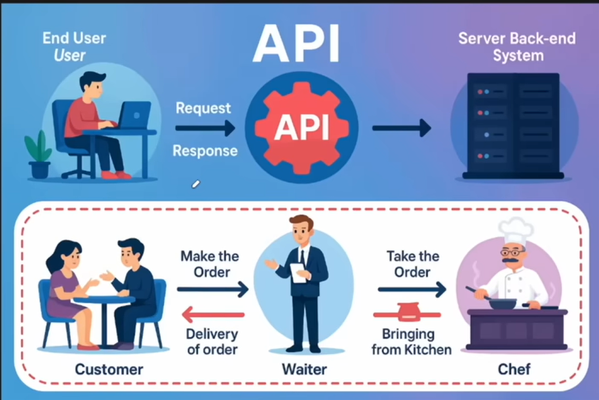
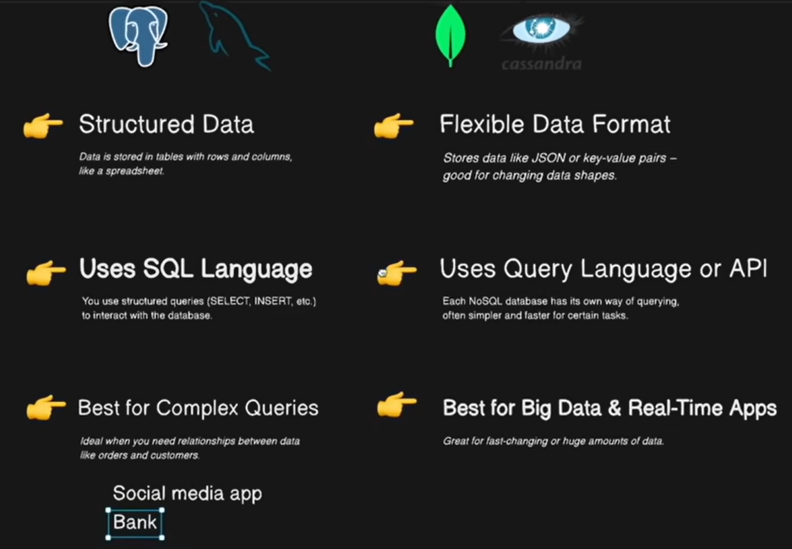

# 🚀 MERN Stack — Learning Notes

**MERN** stands for:

| Letter | Technology | Role |
|--------|-----------|------|
| **M** | MongoDB | Database |
| **E** | Express.js | Backend Framework |
| **R** | React.js | Frontend Library |
| **N** | Node.js | JavaScript Runtime |

---

## 🟢 M — MongoDB

- A **NoSQL database** where we store our application data.
- Stores data as flexible JSON-like documents instead of rigid tables.

---

## 🟡 E — Express.js

- A **web framework** (a ready-to-use toolbox) for building web applications faster and more easily.

### ❓ Why use a web framework?

- Saves development time
- Makes code clean and organized
- Handles common tasks (routing, error handling, middleware, etc.)

---

## 🟣 N — Node.js

- A **JavaScript runtime** that allows you to run JavaScript on the server.
- Normally, JavaScript runs on the client side (browser).
- Node.js enables JavaScript execution on the **backend (server)**.

---

## 🔵 R — React.js

- A **frontend library** used to build interactive user interfaces.

---

## 🔄 How the Flow Works

```
Frontend        Backend                  Database
React    →   Node.js + Express    →    MongoDB
```

---

# ⚙️ Backend Setup

## 📌 Commands to Run

### 1️⃣ Initialize Node.js Application

```bash
npm init -y
```

### 2️⃣ Install Dependencies

```bash
npm install
```

> This will install all the necessary libraries defined in `package.json`.

---

### 3️⃣ Custom Scripts in `package.json`

Add custom commands in the `scripts` section:

```json
"scripts": {
  "start": "node server.js",
  "dev": "nodemon server.js",
  "devara": "node server.js"
}
```

Now you can run:

```bash
npm start        # for production
npm run dev      # for development with auto-reload
npm run devara   # to start with your custom command
```

---

## 📡 What is an API?

**API (Application Program Interface)** allows two applications to communicate with each other.

Think of it like a waiter in a restaurant:

| Role | Maps To |
|------|---------|
| 🧑 Customer placing order | Frontend (React) |
| 🧾 Waiter taking the order | API |
| 👨‍🍳 Kitchen preparing food | Backend (Node.js / Express) |
| 🍽️ Food being served | Response / Data |
| 📦 Storage room | Database (MongoDB) |

---

# 🔌 Types of APIs

## REST API
Uses HTTP methods — most commonly used approach.

```
GET    → Fetch posts on Instagram
POST   → Create a new post
PUT    → Update an existing post
DELETE → Delete a post
```

## SOAP API
Uses XML format with strict protocol rules. Mostly used in enterprise applications.

> **Example:** Banking system transferring money between accounts using secure XML requests.

## GraphQL API
Allows clients to request **only the data they need**. Developed by Facebook.

> **Example:** Fetch only `username` and `profilePicture` instead of the full user object.

## gRPC API
High-performance API using Protocol Buffers and HTTP/2. Created by Google.

> **Example:** Communication between microservices in a food delivery app.

## WebSocket API
Provides **real-time, two-way** communication between client and server.

> **Example:** Live chat feature in WhatsApp.

## OpenAPI
A specification to describe REST APIs for easy understanding and testing.

> **Example:** API documentation generated using Swagger tools.

---

# 📊 HTTP Status Codes

| Range | Category | Common Codes |
|-------|----------|-------------|
| **1xx** | Informational | Request received, continuing process |
| **2xx** | ✅ Success | `200 OK`, `201 Created` |
| **3xx** | 🔀 Redirection | `301 Moved Permanently` |
| **4xx** | ❌ Client Errors | `400 Bad Request`, `401 Unauthorized`, `403 Forbidden`, `404 Not Found`, `429 Too Many Requests` |
| **5xx** | 💥 Server Errors | `500 Internal Server Error`, `503 Service Unavailable` |

---

# 🛠️ Debugging Tips

To check HTTP errors in the browser:

1. Press `F12` or right-click → **Inspect**
2. Go to the **Network** tab
3. Select **All** or **Fetch/XHR**
4. Refresh the page to see API calls and their status codes

---

## 🔄 Development vs Production

### Using Nodemon for Development

Without `nodemon`, you have to **manually restart** the server after every code change.

Install nodemon as a dev dependency:

```bash
npm install nodemon -D
```

> The `-D` flag installs it as a dev dependency (only needed during development).

Update `package.json` scripts:

```json
"scripts": {
  "start": "node server.js",
  "dev": "nodemon server.js"
}
```

Now when you run `npm run dev`, Nodemon will **watch your files** and automatically restart the server when changes are saved.

> ⚠️ **Important:**
> - **Development** → Use `nodemon` (`npm run dev`) for auto-reload
> - **Production** → Use `node` (`npm start`) for better performance and stability
> - ❌ **Never use nodemon in production!**

---

## A Quick Review

## 🔗 What is an Endpoint?

An **endpoint** is a combination of a **URL + HTTP method** that lets the client interact with a specific resource.

> 💡 An endpoint is essentially what we also call a **route**.

```js
// Example endpoints
GET    /api/notes        → fetch all notes
POST   /api/notes        → create a new note
DELETE /api/notes/:id    → delete a note by ID
```

---

## 🗂️ Project Structure — Keeping It Scalable

As projects grow, dumping everything in one file becomes a nightmare to maintain.
The solution? **Follow good practices (GP)** and split your code into dedicated folders.

### 📁 Recommended Folder Structure

```
backend/
└── src/
    ├── routes/          → defines URL paths
    ├── controllers/     → holds the actual business logic
    └── server.js
```

---

### 🚦 Routes

Instead of writing every route directly in `server.js`, group related routes into separate files.

```js
// server.js — clean and minimal
app.use("/api/notes", NotesRouter);
```

> The `NotesRouter` file handles all `/api/notes` endpoints cleanly in one place.

---

### 🧠 Controllers

Controllers exist to keep route files **small and readable** by moving the backend logic out.

| File | Responsibility |
|------|---------------|
| `routes/notes.js` | Defines the URL paths |
| `controllers/notesController.js` | Contains the actual logic |

```js
// routes/notes.js ← stays small
router.get("/", notesController.getAllNotes);
router.post("/", notesController.createNote);

// controllers/notesController.js ← business logic lives here
exports.getAllNotes = async (req, res) => { ... };
exports.createNote = async (req, res) => { ... };
```

---

### ❓ Do We Even Need This Structure?

**Yes** — especially when building apps with multiple pages/features.
Keeping routes and controllers separate means:

- Each page/feature has its own **isolated** API logic
- Files stay **small and focused**
- Onboarding new devs (or future-you 😄) is painless

---

> **🟡 GP — Good Practice**
>
> Move everything into a `src/` folder inside your backend.
> If you do, make sure to update your `package.json` scripts accordingly:
>
> ```json
> "scripts": {
>   "start": "node src/server.js",
>   "dev": "nodemon src/server.js"
> }
> ```

---
test you api with this."http://localhost:5001/api/notes/status_code"


# 🗄️ Types of Databases
 
A **database** is an organized collection of structured data, stored and accessed electronically.
 
---
 
## 📊 1. Relational Databases (SQL)
 
- Stores data in **tables** (rows & columns) — like a spreadsheet.
- Uses **SQL (Structured Query Language)** to query data.
- Data has a **fixed schema** — you define the structure upfront.
- Tables can be **linked** to each other using keys.
 
```sql
-- Example: fetch all users from a users table
SELECT * FROM users WHERE age > 18;
```
 
**Popular SQL Databases:**
 
| Database | Known For |
|----------|-----------|
| PostgreSQL | Open-source, powerful, great for complex queries |
| MySQL | Most widely used, great for web apps |
| SQLite | Lightweight, file-based, great for local/dev use |
| MS SQL Server | Microsoft ecosystem, enterprise use |
| Oracle | Large-scale enterprise applications |
 
> ✅ **Use SQL when:** your data is structured, relationships matter, and consistency is critical (e.g. banking, e-commerce).
 
---
 
## 🍃 2. Non-Relational Databases (NoSQL)
 
- Stores data in **flexible formats** — documents, key-value pairs, graphs, etc.
- **No fixed schema** — each record can have different fields.
- Designed to **scale horizontally** (across multiple servers).
- Great for **large volumes of unstructured or semi-structured data**.
 
```json
// Example: a MongoDB document (looks like JSON)
{
  "_id": "abc123",
  "name": "Nisanth",
  "skills": ["Python", "FastAPI", "Docker"],
  "location": "India"
}
```
 
**Types of NoSQL Databases:**
 
| Type | How it stores data | Example |
|------|--------------------|---------|
| 📄 Document | JSON-like documents | MongoDB, CouchDB |
| 🔑 Key-Value | Simple key → value pairs | Redis, DynamoDB |
| 📋 Column-Family | Columns grouped together | Cassandra, HBase |
| 🕸️ Graph | Nodes & edges (relationships) | Neo4j, ArangoDB |
 
> ✅ **Use NoSQL when:** your data is unstructured, schema changes often, or you need massive scale (e.g. social media, real-time apps).
 
---
 
## ⚡ 3. In-Memory Databases
 
- Stores data **directly in RAM** instead of on disk.
- Extremely **fast** reads and writes.
- Data is **lost on restart** (unless persistence is configured).
 
> **Example:** Redis — used for caching, session storage, leaderboards, pub/sub messaging.
 
```js
// Redis example — cache a value for 60 seconds
SET user:101 "Nisanth" EX 60
GET user:101  // → "Nisanth"
```
 
> ✅ **Use when:** you need lightning-fast temporary storage — caching API responses, storing sessions, rate limiting.
 
---
 
## 🔍 4. Search Databases (Full-Text Search Engines)
 
- Optimized for **searching large amounts of text** quickly.
- Supports fuzzy search, filters, ranking, and aggregations.
 
> **Example:** Elasticsearch, Apache Solr
 
> ✅ **Use when:** you need advanced search — product search, log analysis, autocomplete.
 
---
 
## 📈 5. Time-Series Databases
 
- Optimized for data that changes **over time** — metrics, events, logs.
- Handles **high write throughput** and time-based queries efficiently.
 
> **Example:** InfluxDB, TimescaleDB, Prometheus
 
> ✅ **Use when:** tracking server metrics, IoT sensor data, financial ticks, monitoring dashboards.
 
---
 
## 🆚 Database Types — Full Comparison
 
| Feature | 🗃️ SQL | 🍃 NoSQL | ⚡ In-Memory | 🔍 Search | 📈 Time-Series |
|---------|--------|---------|-------------|----------|---------------|
| **Structure** | Tables (rows & columns) | Documents / Key-Value / Graph / Column | Key-Value pairs in RAM | Inverted index | Timestamped records |
| **Schema** | Fixed (strict) | Flexible (dynamic) | Flexible | Flexible | Fixed (time + value) |
| **Query Language** | SQL | Varies (MQL, CQL, etc.) | Varies (Redis CLI, etc.) | DSL / REST API | InfluxQL / PromQL |
| **Speed** | Moderate | Fast | 🚀 Extremely Fast | Fast (search-optimized) | Fast (write-optimized) |
| **Scaling** | Vertical ⬆️ | Horizontal ➡️ | Horizontal ➡️ | Horizontal ➡️ | Horizontal ➡️ |
| **Relationships** | ✅ Strong (joins, foreign keys) | ⚠️ Weak / manual | ❌ None | ❌ None | ❌ None |
| **Consistency** | Strong (ACID) | Eventual (BASE) | Eventual | Eventual | Strong |
| **Persistence** | ✅ Yes | ✅ Yes | ⚠️ Optional (lost on restart) | ✅ Yes | ✅ Yes |
| **Best For** | Structured relational data | Unstructured / high-volume data | Caching, sessions, rate limiting | Full-text search, autocomplete | Metrics, IoT, monitoring |
| **Examples** | PostgreSQL, MySQL, SQLite | MongoDB, Cassandra | Redis, Memcached | Elasticsearch, Solr | InfluxDB, Prometheus, TimescaleDB |
| **Used In MERN?** | ❌ (replaced by Mongo) | ✅ MongoDB is NoSQL | ✅ Redis for caching | Sometimes | Rarely |
 
---
 
> 🟡 **GP — Good Practice**
>
> Don't pick a database based on hype — pick it based on your **data shape** and **access patterns**.
>
> | If you need... | Use... |
> |----------------|--------|
> | Relationships & transactions | SQL (PostgreSQL / MySQL) |
> | Flexible schema & scale | NoSQL (MongoDB) |
> | Lightning-fast temporary storage | In-Memory (Redis) |
> | Powerful text search | Search DB (Elasticsearch) |
> | Metrics over time | Time-Series (InfluxDB / Prometheus) |
>
> In real-world apps, you'll often use **more than one** — for example, PostgreSQL for core data + Redis for caching + Elasticsearch for search.
 
---
 
## A Quick Review


# Integration steps
Step1->head over to mongodb.com
Step2->create or login
Step3->create project in mongo db. go to view all project if you can't see it here.
Step4->Create cluster.->Free Plan.
Steps5->create user name and password
Step6->Chose a way to connect
Step7->select driver for application and follow the steps use mongoose instead.
better because it will schmea validation 
Steps8->go to network access and add from anywhere so that you can access it from anywhere but remove it when it goes to production.

you can either create a config folder to connect or save the link in env and use it as well in both ways you can use it anywhere.